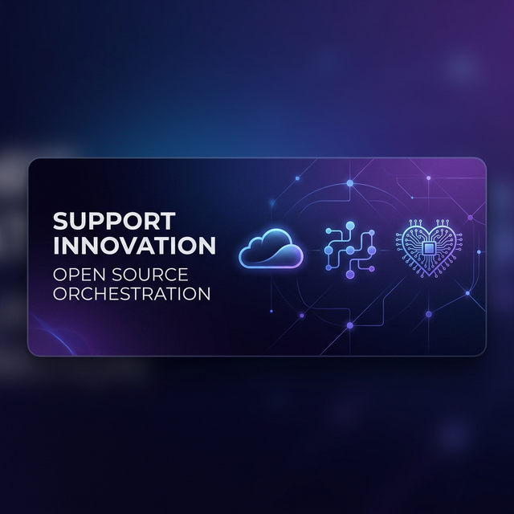

# 🧠 Howchestrator LITE
### High-Performance Generic Resource Orchestrator in Go


> **"Orchestration isn't just about servers. It's about total control over your distributed workload."**

---

## 🌍 Language Versions / Idiomas / Traducciones
- [English](#-english)
- [Português (Brasil)](#-português-brasil)
- [Español](#-español)

---

## 🇺🇸 English

### 🚀 What is Howchestrator LITE?
Howchestrator is a lightweight, high-performance distributed system designed to manage the lifecycle of ephemeral resources (processes, containers, or services) across multiple remote nodes. 

Built with **Go**, it demonstrates a classic **Control Plane / Agent** architecture, ensuring low latency and high reliability for projects that need to scale horizontally.

### 💎 Key Features
- **Centralized Control Plane**: A single "Brain" that manages resource allocation, node health, and scheduling.
- **Lightweight Agents**: Small binaries that run on target nodes, performing the heavy lifting and reporting back via high-speed webhooks.
- **Protocol Agnostic**: Designed to orchestrate anything from game servers to AI inference runners or dynamic CI/CD workers.
- **Zero-Dependency Core**: This LITE version works out-of-the-box with in-memory storage and simulated process management.

### 🏗️ Architecture
- **Control Plane**: Exposes a REST API for clients and a Webhook endpoint for Agents.
- **Agent**: Registers with the Brain, waits for commands, and manages local resources (simulated by port activation).
- **Shared Contracts**: Consistent JSON schemas for reliable data exchange.

---

## 🇧🇷 Português (Brasil)

### 🚀 O que é o Howchestrator LITE?
O Howchestrator é um sistema distribuído leve e de alta performance, projetado para gerenciar o ciclo de vida de recursos efêmeros (processos, containers ou serviços) em múltiplos nós remotos.

Desenvolvido em **Go**, ele demonstra uma arquitetura clássica de **Control Plane / Agent**, garantindo baixa latência e alta confiabilidade para projetos que precisam de escalabilidade horizontal.

### 💎 Destaques do Projeto
- **Control Plane Centralizado**: Um "Cérebro" único que gerencia alocação de recursos, saúde dos nós e agendamento.
- **Agentes Leves**: Binários otimizados que rodam nos nós de trabalho, executando as tarefas e reportando o status via webhooks de alta velocidade.
- **Agnóstico a Protocolo**: Projetado para orquestrar desde servidores de jogos até instâncias de IA ou workers dinâmicos de CI/CD.
- **Core sem Dependências**: Esta versão LITE funciona instantaneamente com armazenamento em memória e simulação de processos.

### 🏗️ Arquitetura
1. **Discovery**: O Agente se autodeclara para o Cérebro.
2. **Request**: O cliente solicita um recurso via API.
3. **Execution**: O Agente "abre" o recurso e confirma via Webhook em tempo real.

---

## 🇪🇸 Español

### 🚀 ¿Qué es Howchestrator LITE?
Howchestrator es un sistema distribuido ligero y de alto rendimiento diseñado para gestionar el ciclo de vida de recursos efímeros (procesos, contenedores o servicios) en múltiples nodos remotos.

Construido con **Go**, demuestra una arquitectura clásica de **Plano de Control / Agente**, asegurando baja latencia y alta confiabilidad para proyectos que requieren escalabilidad horizontal.

### 💎 Características Principales
- **Plano de Control Centralizado**: Un "Cerebro" único que gestiona la asignación de recursos, la salud de los nodos y la programación.
- **Agentes Ligeros**: Binarios optimizados que se ejecutan en los nodos de trabajo, realizando el trabajo pesado y reportando el estado mediante webhooks de alta velocidad.
- **Agnóstico al Protocolo**: Diseñado para orquestar desde servidores de juegos hasta corredores de inferencia de IA o trabajadores dinámicos de CI/CD.
- **Núcleo sin Dependencias**: Esta versión LITE funciona de inmediato con almacenamiento en memoria y gestión de procesos simulados.

---

## 🛠️ Performance & Tech Stack
- **Language**: Go (Golang) for concurrency and speed.
- **Architecture**: Distributed Master/Worker.
- **State Management**: Scalable Repository Pattern.
- **Communication**: JSON over HTTP (Easily upgradable to gRPC).

## 🚀 Quick Run
```bash
# 1. Start the Brain
cd control-plane && go run main.go

# 2. Start the Agent (in another terminal)
cd agent && go run main.go

# 3. Simulate a client request
./client_test.sh
```

---
---
**Developed with 🧠 by [howzera](https://github.com/howzera)**

## 💖 Support the Project
If you find this orchestrator useful and want to support continued development of open-source cloud infrastructure tools, consider making a donation.

[](YOUR_STRIPE_LINK_HERE)

*Every contribution helps keep the servers running and the code evolving.*
